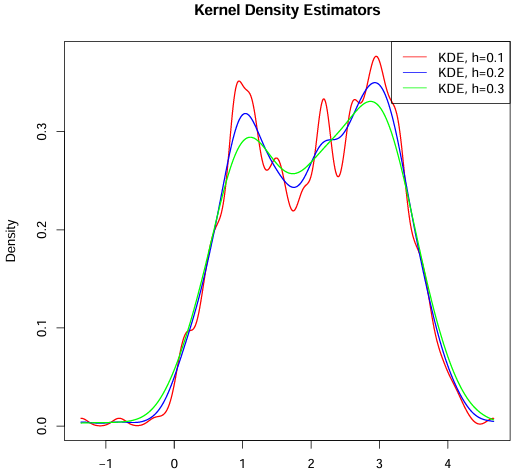
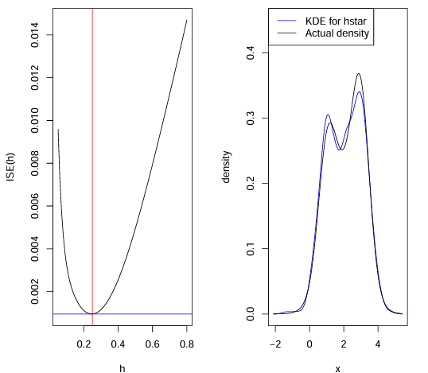
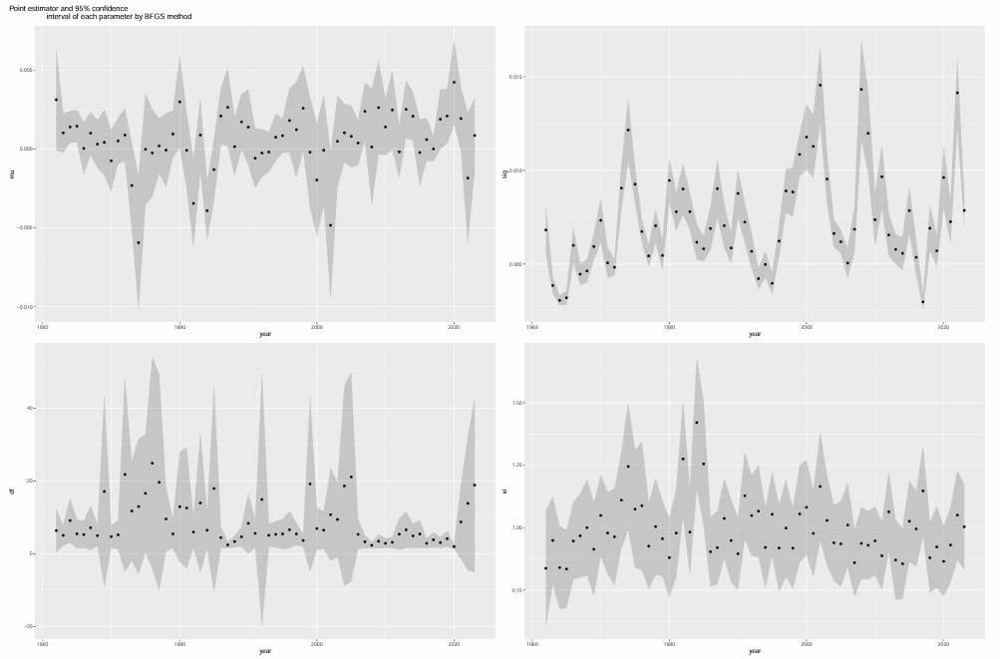
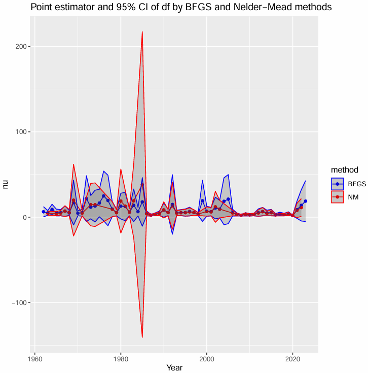
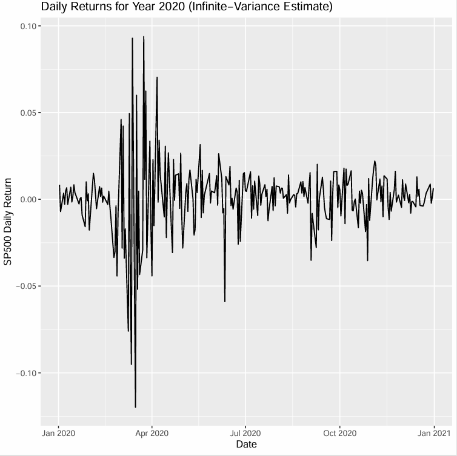
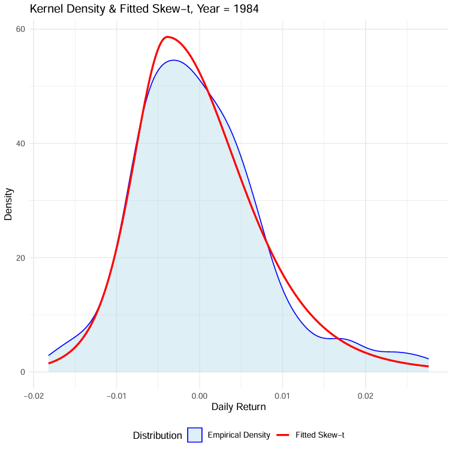
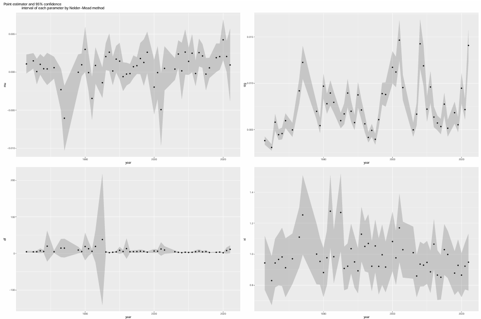

# 📊 Statistical Inference and Density Estimation in R

This repository presents a comprehensive statistical modeling project written in **R with LaTeX integration** (`.Rnw`). It covers analytical derivation and simulation-based validation of:

- Mixture models using method of moments
- Kurtosis-based t-distribution fitting
- Kernel Density Estimation (KDE) with ISE minimization
- Skewed-t distribution maximum likelihood estimation (MLE) across 60+ years of S&P 500 returns

---

## 🧮 Sample Code

```r
set.seed(123)
n = 1000; p = 0.3; mu = 0; c = 2
mix = rbinom(n, 1, p)
X = mu + c * (2 * mix - 1) + rnorm(n)

m1 = mean(abs(X - mean(X)))
m2 = var(X)
c_hat = sqrt(m2)
p_hat = (m1 / c_hat + 1) / 2

ISE = function(h, x) {
  fhat = density(x, bw=h)$y
  ftrue = dnorm(x)
  mean((fhat - ftrue)^2)
}
opt_h = optimize(ISE, c(0.05, 0.8), x=X)$minimum

negloglik = function(par, x) {
  mu = par[1]; sigma = exp(par[2])
  nu = exp(par[3]); xi = par[4]
  loglik = -sum(log(dskewt(x, mu, sigma, nu, xi)))
  return(loglik)
}
optim(par=c(0, log(1), log(5), 1), fn=negloglik, x=returns)
```
---

## 🗂 Project Files
| File | Description |
|------|-------------|
| `Statistical-Inference-and-Density-Estimation.Rnw` | Main R + LaTeX source |
| `Statistical-Inference-and-Density-Estimation.pdf` | Compiled report |
| `sp500_full.csv` | Historical S&P 500 data |

---

## 📌 Topics Covered

### 1️⃣ Kernel Density Estimation & ISE Minimization

Simulated data from a 2-component Gaussian mixture and estimated density using different kernel bandwidths.

#### 📊 KDE Visualization at Different \( h \)


#### 📉 ISE Minimization to Find Optimal \( h^* \)


#### 📐 KDE vs True Density at Optimal \( h = 0.25 \)


---

### 2️⃣ Skewed-t Distribution MLE on S&P 500 Returns (1962–2023)

Estimated four parameters: \( \mu, \sigma, \nu, \xi \) using both BFGS and Nelder-Mead optimization methods. Plotted 95% confidence intervals and parameter trajectories across decades.

#### 📊 Point Estimate & CI (BFGS)


#### 📊 Point Estimate & CI (Nelder-Mead)


#### 📈 Year 2020 Daily Returns (Infinite Variance)


#### 📈 KDE vs Fitted Skew-t (1984)


---

## ✅ Key Findings & Conclusion

- 📌 **Method of Moments** successfully recovers \( \mu, p, c \) using absolute deviation and variance; confidence intervals for estimators are derived via simulation (n=500, N=1000).
- 📌 **Kurtosis-based estimation** shows that for kurtosis = 9, the best-fitting t-distribution has \( \nu = 5 \).
- 📌 **KDE bandwidth optimization** via ISE yields optimal \( h^* = 0.25 \), balancing bias and variance in the mixture distribution.
- ⚠️ **2020 has infinite variance** (both BFGS: \( \nu = 1.98 \), NM: \( \nu = 1.91 \)) due to extreme COVID-19 market shocks.
- 📉 **Heavy-tailed years** include 1987 (Black Monday), 2008 (Global Financial Crisis), 2010 (Flash Crash), and 2016 (Geopolitical events).
- 🎯 **Statistically significant skewness** found in 1965, 1982, 1984, 1985, 2007, and 2014. For example, 1984 has \( \hat{\xi} = 1.42 \), rejecting the null hypothesis \( H_0: \xi = 1 \) at 5% level.
- 🧭 **BFGS is more stable** than Nelder-Mead across all parameter estimates, especially for estimating the degrees of freedom parameter \( \nu \).

---

## 💻 How to Compile

To reproduce the report:

1. Open `Statistical-Inference-and-Density-Estimation.Rnw` in **RStudio**
2. Set knitting engine to **knitr**
3. Click **Knit to PDF**
